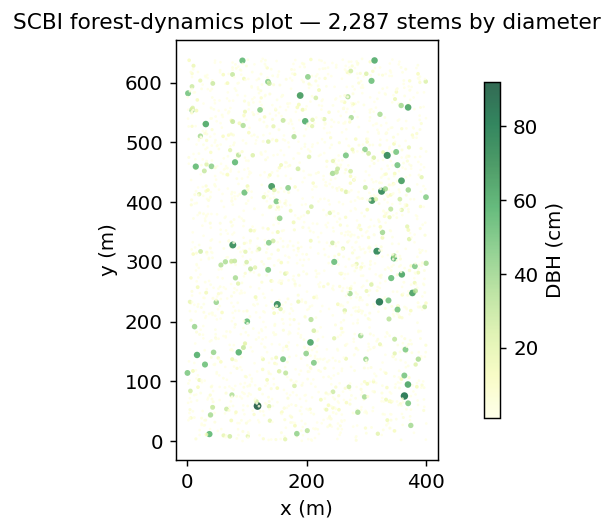
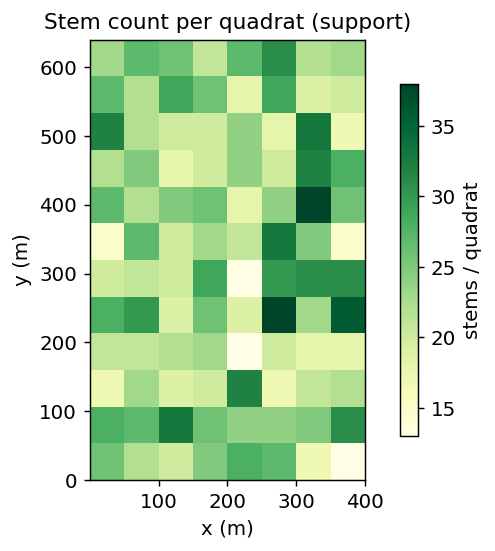
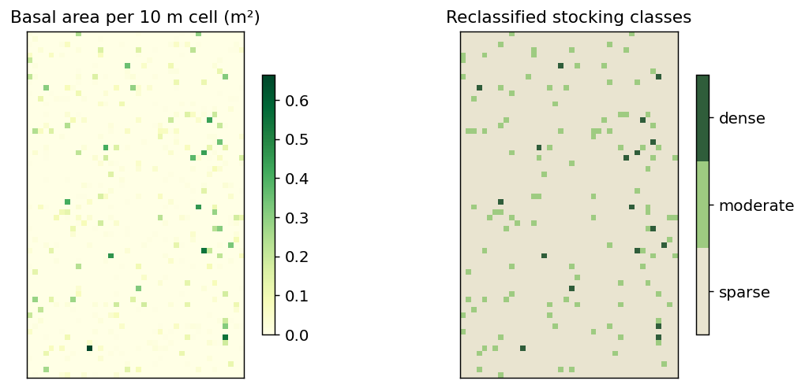
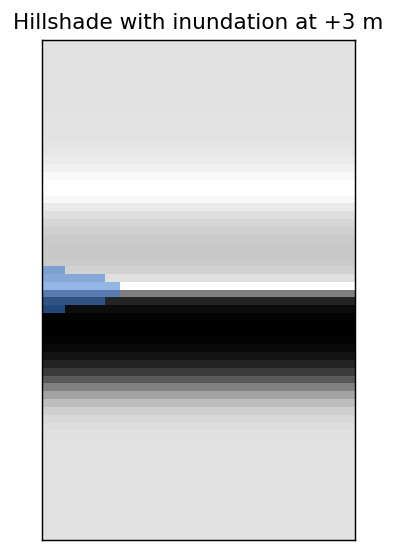
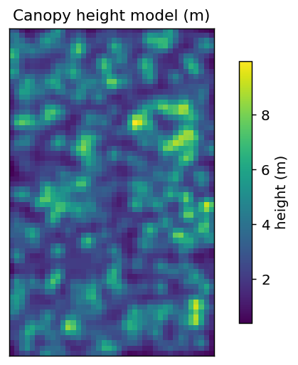
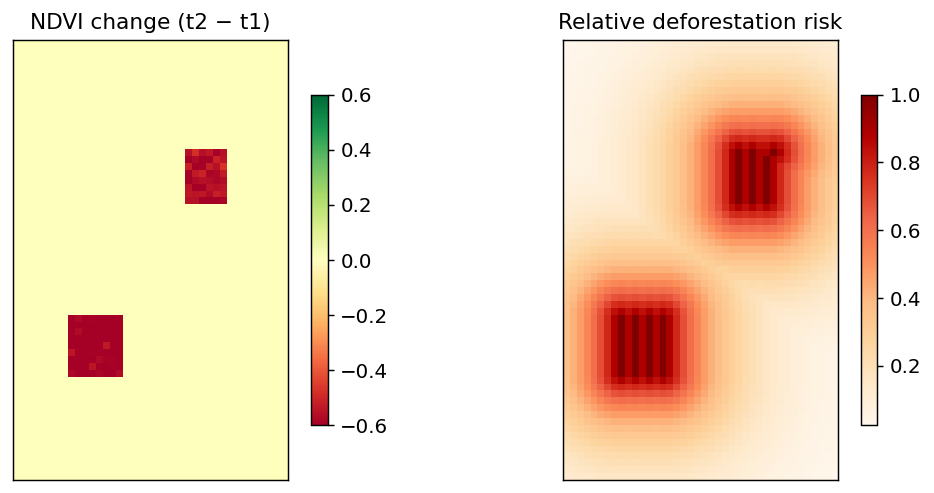
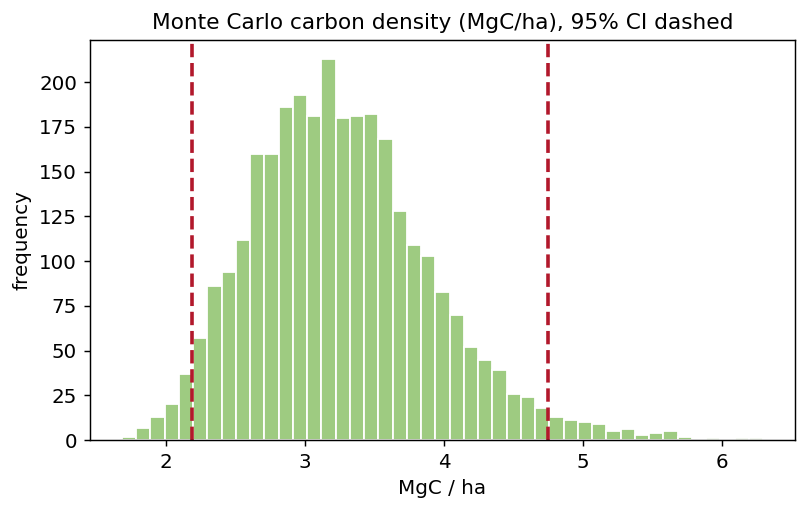
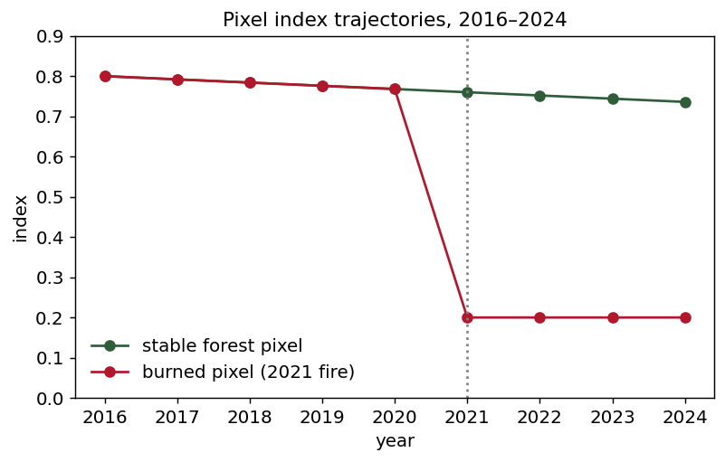
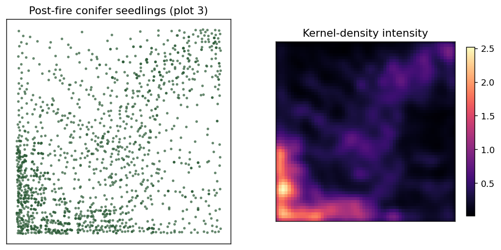

# Spatial Data Analysis in R for Forest Carbon

A practical GIS and remote-sensing course in R, written by Dr Seamus Murphy for forest, carbon, and agriculture auditors. Nine short chapters run from simple to complex, each teaching a foundational concept on one running forest dataset and closing with a worked example from a real verification project.



The running dataset is a mapped forest-dynamics plot modelled on the Smithsonian ForestGEO census at the Conservation Biology Institute in Front Royal, Virginia: 2,287 stems in a 400 by 640 metre plot, each identified to species and measured for diameter. Every chapter teaches on this one plot, so a single dataset carries from raw coordinates through to a quantified emission.

## The course

| # | Chapter | You learn | Closes on |
|---|---------|-----------|-----------|
| 1 | Getting Started | Reproducible projects, the spatial stack, vector vs raster, a first map and CRS check | A first map and coordinate check |
| 2 | Vector Data | Geometries, attributes and support, spatial joins | Area check (validity, area, overlap) |
| 3 | Raster Data | Grids, map algebra, reclassification, extraction | Land-cover reclassification |
| 4 | Terrain and Hydrology | DEM, slope and aspect, hillshade, flow | Inundation mapping |
| 5 | LiDAR and Point Clouds | Returns, ground and canopy, DTM/CHM, tree detection | LiDAR forest inventory |
| 6 | Disturbance and Risk | Change detection, accuracy assessment, risk modelling | VM0048 risk and ACR accuracy |
| 7 | Uncertainty | Sampling error, Monte Carlo, conservative estimates | Area-adjusted accuracy |
| 8 | Time Series (capstone I) | Space-time cubes, temporal reduction, trends | IPCC Tier 1 fire emissions |
| 9 | Spatial Patterns (capstone II) | Point patterns, intensity, nearest-neighbour, Ripley's K | Post-fire conifer regeneration |

An appendix covers the surrounding discipline: reproducible runtimes, spatial-data protocols and ISO governance, and ART-TREES / Verra / ACR registry practice.

## What each chapter builds

### Vector foundations and the area check

Chapters 1 and 2 turn the stem table into geometry, impose a sampling frame, and reason about attribute support. The quadrat grid below is the basis of the closing area check, where claimed area is reconciled against measured geometry and parcels are tested for overlap.



### Raster data and land-cover reclassification

Chapter 3 rasterises the stems into a continuous surface, then reclassifies it, the exact operation behind any land-use / land-cover map and the forest-area figures a project claims.



### Terrain and hydrology

Chapter 4 derives slope, aspect, hillshade, and flow from an elevation model, then thresholds it to map inundation, with a stage–area rating curve that drives every wetland-area claim.



### LiDAR and point clouds

Chapter 5 builds a canopy height model and detects individual trees, the bridge from wall-to-wall remote sensing to a calibrated biomass map.



### Disturbance and spatial risk

Chapter 6 differences two dates to detect loss, validates the map with a confusion matrix, and models where further loss is likely.



### Uncertainty

Chapter 7 attaches an honest confidence interval to a carbon estimate by Monte Carlo propagation, then does the same for a land-cover area with the good-practice area-adjusted estimator.



### Time series — capstone I

Chapter 8 stacks the plot into a nine-year cube, finds the per-pixel trend, detects a fire, and turns the burned area into an IPCC Tier 1 emission with its own interval.



### Spatial patterns — capstone II

Chapter 9 runs point-pattern analysis on the real, published coordinates of a post-fire conifer regeneration survey in the Selkirk Mountains. The seedlings cluster sharply near surviving seed sources, quantified by the Clark–Evans ratio and Ripley's K.



## Data

All data live in `data/` and are ready to run.

| Dataset | Rows | Role | Source |
|---------|------|------|--------|
| `scbi_stems.csv` / `.shp` | 2,287 stems | Running dataset for chapters 1–8 | ForestGEO census (SCBI); within-plot coordinates generated across the real footprint |
| `darkwoods_seedlings.csv` | 3,912 seedlings | Capstone II point pattern | Published regeneration survey, southern Selkirk Mountains, BC |
| `eq_tab_acer.csv`, `scbi_quercus.csv` | — | Allometry reference | Companion uncertainty book |

The SCBI stem list (species, diameter) follows the published ForestGEO census; its within-plot coordinates were generated across the real plot footprint because the source table omitted them, so the maps are representative rather than a survey of record. Terrain, imagery, LiDAR, and time-series layers are simulated over the same footprint so the book renders offline, and every synthetic layer says so where it is built. The darkwoods seedlings use the real published coordinates.

## Building the book

```bash
# clear the stale index and exFAT sidecar files, then render
rm -rf .quarto _book && find . -name '._*' -delete
quarto render
```

Install the R packages once with `source("setup.R")`. Styling is in `styles.scss`; the bibliography, citation style, and Word reference document live in `references/`. The `rm -rf .quarto` and `find … -delete` steps avoid a stale-index error on exFAT drives.

## Repository layout

```
training-rspatial/
├── index.qmd                     # preface
├── 01-getting-started.qmd … 09-spatial-patterns.qmd
├── A-automation-registries.qmd   # appendix
├── data/                         # ready-to-run datasets
├── images/                       # README figures
├── references/                   # .bib, .csl, style.docx, source paper
├── archive/                      # superseded chapter drafts
├── setup.R                       # package installer
├── styles.scss                   # theme
└── _quarto.yml                   # book configuration
```

## Reference

The Chapter 9 capstone reproduces the core analysis of:

> Murphy, S., Leslie, A., Wilson, J., & Banks, L. K. (2026). Spatial patterns of conifer regeneration following Mountain pine beetle outbreak (*Dendroctonus ponderosae*) and mixed-severity wildfire: A point process model of disturbance interactions in the southern Selkirk Mountains, British Columbia. *Forest Ecology and Management*, 618, 123985. https://doi.org/10.1016/j.foreco.2026.123985

Author: Dr Seamus Murphy · ORCID [0000-0002-1792-0351](https://orcid.org/0000-0002-1792-0351)
