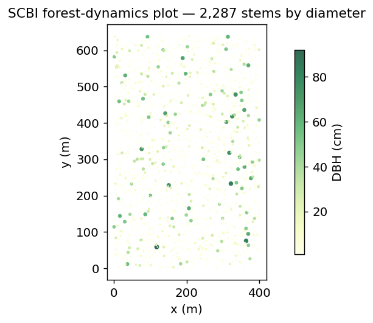
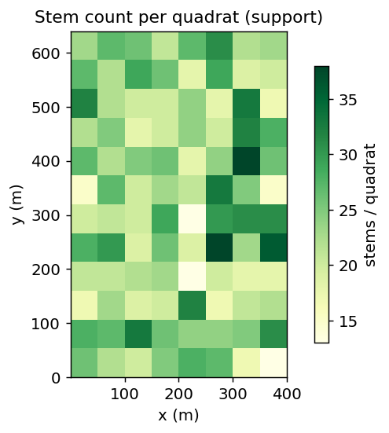
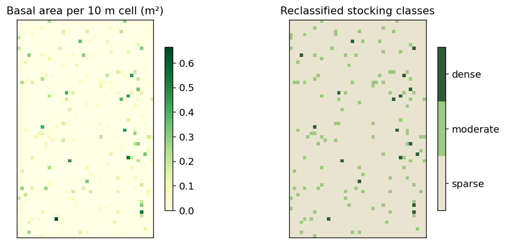
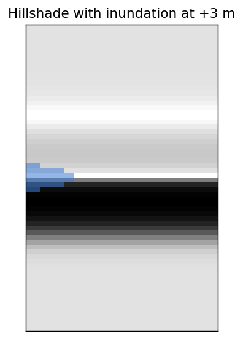
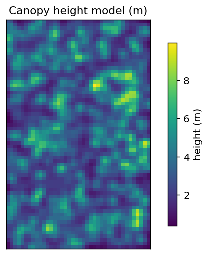
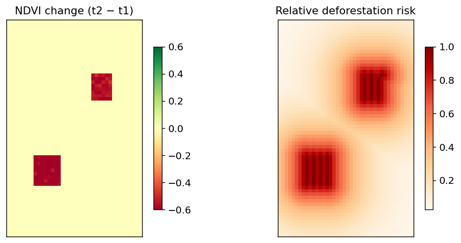
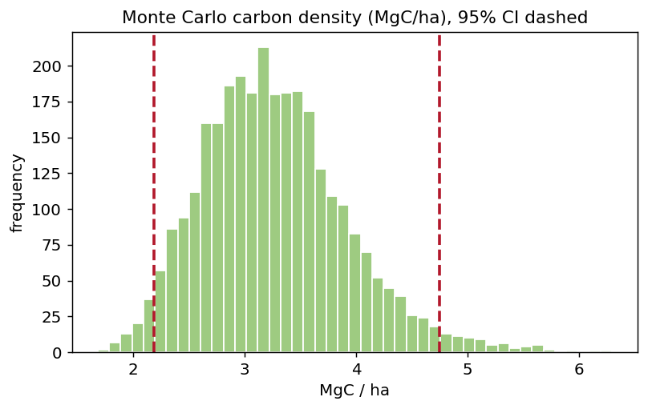
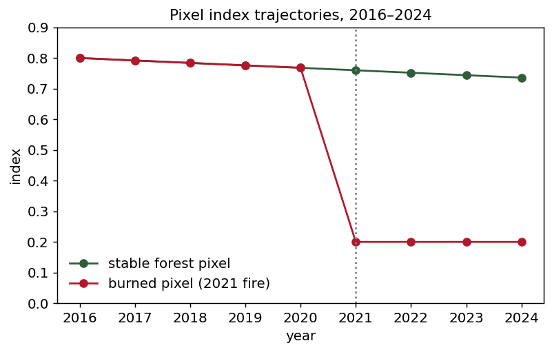
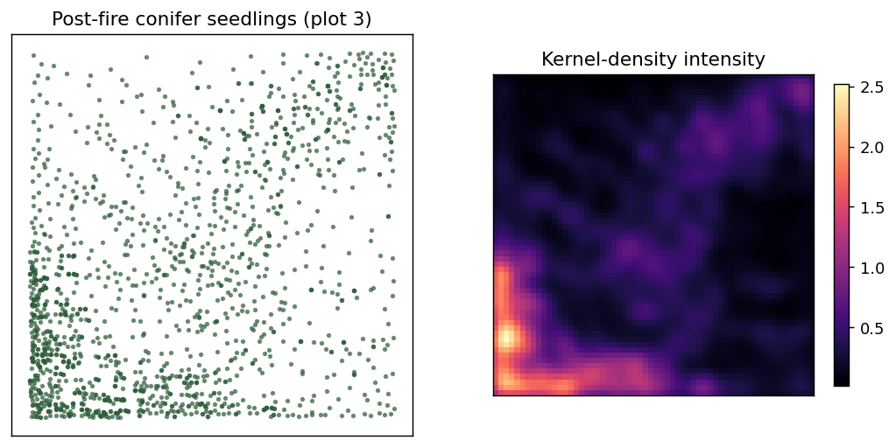

# Spatial Analysis in R for Forest Carbon Verification

A practical training in GIS and applied statistics for forest carbon measurement and verification, written by Dr Seamus
Murphy. Thirteen chapters run from reading a shapefile to reporting an area-adjusted emission with a defensible
interval, entirely in R and entirely reproducibly.

  

The book is written for two readers at once. The main text teaches the method and can be read straight through without
reference to any crediting standard. Interleaved with it are **verification tracks**, set off in tinted boxes, carrying
the registry-specific material that only practitioners need: what ART-TREES, Verra and the American Carbon Registry
require, where their equations are written down, and how each converts a statistic into forgone credits. Skip every
track and the book is still complete.

One plot anchors the book: the Smithsonian ForestGEO census at the Conservation Biology Institute in Front Royal,
Virginia, 38,517 living stems across 39 genera in a 400 by 640 metre footprint. Four further real datasets carry the
chapters it cannot answer: a 2022 Sentinel-2 land-cover map of Rondonia for raster, activity data and disturbance work; a
Lake Chilwa elevation model and its HydroSHEDS hydrography for terrain and hydrology; airborne laser tiles for LiDAR; and
a published post-fire regeneration survey in the Selkirk Mountains for point patterns. Every figure and number in the
text is generated by code that ships with the book and runs offline.

## Course summary

| \# | Chapter | Learning Materials | Leaning Outcomes |
|----|----|----|----|
| 1 | Getting Started | Reproducible projects, the spatial stack, vector vs raster | A first map and coordinate check |
| 2 | Vector Data | Geometries, attributes and support, spatial joins | Area check (validity, area, overlap) |
| 3 | Raster Data | Grids, map algebra, reclassification, extraction | Land-cover reclassification |
| 4 | Terrain and Hydrology | DEM, slope and aspect, hillshade, flow | Inundation mapping |
| 5 | LiDAR and Point Clouds | Returns, ground and canopy, DTM/CHM, tree detection | LiDAR forest inventory |
| 6 | Disturbance and Risk | Change detection, accuracy assessment, risk modelling | VM0048 risk and ACR accuracy |
| 7 | Allometry and Biomass | Equation form and selection, extrapolation, wood density | What equation choice costs: a 4.75x spread |
| 8 | Emission Factors | Tiers, stock-difference method, factor selection | Propagation in quadrature, and where to spend |
| 9 | Activity Data and Classification | IPCC approaches, training design, probability surfaces | Why stratifying does not fix a rare class |
| 10 | Baseline Modelling | Counterfactuals, reference periods, allocation | Why a baseline is not a forecast |
| 11 | Uncertainty | Metrics, cross-validation, Monte Carlo, area adjustment | Three registries, three deductions |
| 12 | Time Series (capstone I) | Space-time cubes, seasonality, sampling and aliasing | IPCC Tier 1 fire emissions |
| 13 | Spatial Patterns (capstone II) | Point patterns, intensity, nearest-neighbour, Ripley's K | Post-fire conifer regeneration |

An appendixAn appendix covers the surrounding discipline: reproducible runtimes, spatial-data protocols and ISO
governance, and ART-TREES / Verra / ACR registry practice.

## Chapter overviews

### Vector foundations and the area check

Chapters 1 and 2 turn the stem table into geometry, impose a sampling frame, and reason about attribute support. The
quadrat grid below is the basis of the closing area check, where claimed area is reconciled against measured geometry
and parcels are tested for overlap.

  

### Raster data and land-cover reclassification

Chapter 3 rasterises the stems into a continuous surface, then reclassifies it, the exact operation behind any land-use
/ land-cover map and the forest-area figures a project claims.

  

### Terrain and hydrology

Chapter 4 derives slope, aspect, hillshade, and flow from an elevation model, then thresholds it to map inundation, with
a stage–area rating curve that drives every wetland-area claim.

  

### LiDAR and point clouds

Chapter 5 builds a canopy height model and detects individual trees, the bridge from wall-to-wall remote sensing to a
calibrated biomass map.

  

### Disturbance and spatial risk

Chapter 6 differences two dates to detect loss, validates the map with a confusion matrix, and models where further loss
is likely.

  

### Carbon accounting

Chapters 7 to 10 turn the spatial toolkit on the accounting problem, and are where the book departs from every other
R-spatial text.

**Chapter 7, Allometry and Biomass.** Nobody weighs a standing tree; a statistical model converts diameter into mass,
and that model was fitted somewhere else on other trees. Applying five published equations to the same 84 oaks gives
stand totals spanning a factor of 4.75, with no measurement error involved at all. The median published equation is
calibrated over a range holding 40 per cent of the stems it would be applied to and only 13 per cent of their biomass,
because destructive sampling is dominated by small trees while carbon sits in large ones.

**Chapter 8, Emission Factors.** The other half of the activity-data times emission-factor identity. Reference stock
uncertainties in the IPCC tables span eighteenfold, from 5 per cent resting on 781 soil profiles to 90 per cent resting
on none. Because quadrature squares before summing, the biomass growth rate carries 78 per cent of the variance in the
worked example while eliminating the area uncertainty entirely moves the total from 71.2 to 70.5 per cent. Spatial
precision is visible, procurable, and nearly worthless.

**Chapter 9, Activity Data.** A proportional training sample gives 97 per cent overall accuracy while
catching under half the rare class. Stratifying to fix it lifts producer's accuracy above 0.93 and collapses user's
accuracy to 0.29: omission is traded for commission at close to one for one. Only quadrupling the sample passes VM0048's
dual threshold, which is why that threshold is written as a pair.

**Chapter 10, Baseline Modelling.** A baseline is a counterfactual, not a forecast. From a series with no underlying
trend at all, fitting a trend and projecting gives baselines from 626 to 7,607 ha/yr depending only on which five years
are chosen as the reference window. Mandating an average is a worse forecast and a much better rule, and that
distinction is the whole of baseline design.

### Uncertainty

Chapter 11 attaches an honest confidence interval to a carbon estimate by Monte Carlo propagation, then does the same
for a land-cover area with the good-practice area-adjusted estimator.

  

### Time series

Chapter 12 stacks the plot into a nine-year monthly cube, finds the per-pixel trend, detects a fire, and turns the
burned area into an IPCC Tier 1 emission with its own interval.

  

### Point process models

Chapter 13 runs point-pattern analysis on the real, published coordinates of a post-fire conifer regeneration survey in
the Selkirk Mountains. The seedlings cluster sharply near surviving seed sources, quantified by the Clark–Evans ratio
and Ripley's K.

  

## Data

All data live in `data/` and are ready to run.

| Dataset | Size | Role | Source |
|----|----|----|----|
| `scbi_stems.csv` / `.shp` | 38,517 stems | Vector, allometry, biomass, error | ForestGEO census (SCBI); within-plot coordinates generated across the real footprint |
| `rondonia_class_2022.tif` + legend | 9 classes | Raster, activity data, disturbance | Sentinel-2 classification via `sitsdata` |
| `rondonia_ndvi_2022-07-16.tif` | 1200 × 1200 | Index thresholds, class separation | Sentinel-2 composite; values scaled by 10,000 |
| `rondonia_validation.csv` | 2,032 points | Accuracy and area adjustment | Shipped validation sample; join on `label`, not `class_n` |
| `chilwa_dem.tif` | 1536 × 1733 @ 100 m | Terrain, hydrology, inundation | AWS Terrain Tiles via `elevatr` |
| `chilwa_hydro.gpkg` | lake, basin, rivers | Watershed validation | HydroLAKES, HydroBASINS, HydroRIVERS |
| `darkwoods_seedlings.csv` | 3,912 seedlings | Point patterns | Published regeneration survey, southern Selkirk Mountains, BC |
| `eq_tab_acer.csv`, `scbi_quercus.csv` | n/a | Allometry reference | Companion uncertainty book |

Two scripts under `data-raw/` rebuild the derived sets from their sources; the book itself never touches the network. The
LiDAR chapter reads airborne tiles distributed with the `lidR` package, so it ships no data of its own.

The SCBI stem list (species, diameter) follows the published ForestGEO census; its within-plot coordinates were
generated across the real plot footprint because the source table omitted them, so those maps are representative rather
than a survey of record. A small number of illustrative surfaces elsewhere are constructed rather than observed, to
isolate one effect at a time; each says so where it is built and none carries a reported number.
